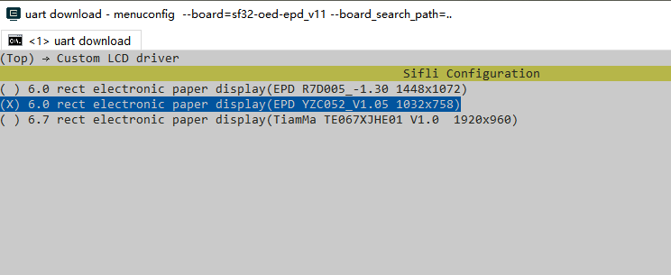

# epub 电子书阅读器

## 概述
* 基于[开源EPUB阅读器](https://github.com/atomic14/diy-esp32-epub-reader), 适配到我们的SF32-OED-EPD开发板，支持如下功能：
1. 从内置flash或者T卡读取电子书文件（优先从T卡读取）
2. 提供3个按键（上、下、选择）
3. 支持中文，英文显示。由于中文点阵字库较大，所以去掉了斜体、粗体的字库(见SF32Paper.cpp, `Renderer *SF32Paper::get_renderer() `函数内)

## 使用指南
### 硬件连接
硬件连接主要是开发板与屏幕的连接，找到相应的卡扣，扣紧（注意查看引脚顺序）就可以连接成功。
<!--（放个链接）-->
### 程序烧录
这里只做简单讲解，详细请查看[编译烧录链接](https://docs.sifli.com/projects/sdk/latest/sf32lb52x/quickstart/build.html)
#### menuconfig配置
首先查看屏幕的型号，确定menuconfig配置相同型号（默认是`6.0 rect electronic paper display(EPD YZC052_V1.05 1032x758)`），然后再进行编译烧录，查看方式如下图
切换到例程project目录，运行menuconfig命令执行编译：
```
menuconfig --board=sf32-oed-epd
```

#### 程序编译与烧录
切换到例程project目录，运行scons命令执行编译：
```
scons --board=sf32-oed-epd -j8
```
运行`build_sf32-oed-epd_hcpu\uart_download.bat`，按提示选择端口即可进行下载：
```
build_sf32l-oed-epd_hcpu\uart_download.bat
Uart Download
please input the serial port num: 5  (填写相应的端口号)
```
## 阅读指南
1. 主界面阅读EPUB文件选择
  上下移动选择：按K3键上移光标，按K1键下移光标，浏览EPUB电子书目录列表。
2. 进入/退出电子书的阅读界面
  进入书籍：光标选中目标电子书后，按下K2键即可打开。
  退出返回：阅读中按下K2键，直接退回主界面。
3. 内容翻阅与设置
  翻页操作：进入电子书后，按K1键向下翻页，按K3键向上翻页。
4. 操作逻辑总结
  K1键：用于基础功能向上移动、翻页；
  K2键：层级递进操作确认键；以及返回主界面；
  K3键：用于基础功能向上移动、翻页。

## 软件框架
主要的程序框架讲解，具体内容可阅读[开源EPUB阅读器](https://github.com/atomic14/diy-esp32-epub-reader)
```
epdiy-epub
│  
├──disk                             # 内置flash，存放少量EPUB电子书文件
├──lib                              # 存放项目依赖的第三方库或自定义基础库
│   ├──epdiy                        # EPD驱动核心库
│   ├──Epub                         # EPUB 解析专用库，负责解析 EPUB 格式文件（解压、读取目录、解析内容结构、提取文本 / 图片等），是阅读器功能基础。 
│   │   ├──EpubList                 # EPUB 文件管理模块 
│   │   ├──Renderer                 # 渲染器模块，将 EPUB 解析后的内容（文本、图片）转换为电子书可显示的格式
│   │   ├──RubbishHtmlParser        # HTML 解析模块，以 XHTML 格式存储，此模块负责解析 HTML 结构，提取文本、图片、样式
│   │   ├──ZipFile                  # 补充解压逻辑（配合 miniz），处理 EPUB 压缩包内的 HTML 及资源文件
│   ├──Fonts                        # 存放字体数据文件，储字符的像素映射
│   ├──Images                       # 图片处理模块，负责加载、解码
│   ├──miniz-2.2.0                  # 轻量级 ZIP 解压库，处理 EPUB 压缩包
│   ├──png                          # PNG 图像解码库，为 PNGHelper 提供底层解码能力。
│   └──tjpgd3                       # JPEG 图像解码库，为 JPEGHelper 提供底层解码能力。
├──project                          # 编译脚本为项目编译、调试、部署提供工具链支持
├──src                              # 项目核心源码目录，实现阅读器业务逻辑
│   ├──boards                       # 硬件板级<br>
│   │    ├──battery                 # 电池管理模块，包含电量检测
│   │    ├──controls                # 输入控制模块（如按键、触摸），处理用户交互（翻页、选菜单等）
│   │    └──display                 # 实现屏幕显示的最终输出，且可能针对不同屏幕型号做适配
│   ├──epub_mem.c                   # 内存管理模块，为 EPUB 解析、渲染分配 / 释放内存，适配嵌入式设备内存限制。
│   │       
│   └──main.cpp                     # 程序入口（main 函数），初始化硬件、加载库、启动阅读器主逻辑（如打开 EPUB 文件、进入阅读界面 ）

```
## 开发指南
### 添加EPUB电子书
* 添加少量EPUB电子书文件，只需要在`epdiy-epub\disk`目录下进行添加相应文件，注意这里存放的空间很小，
* 增加大量EPUB电子书文件，主要通过读取TF卡内容，实现大量文件读取功能

### 更换屏幕
* 已有的两个屏幕型号分别是`6.0 rect electronic paper display(EPD R7D005_-1.30 1448x1072)`、`6.0 rect electronic paper display(EPD YZC052_V1.05 1032x758)`
可以通过menuconfig配置选择不同的屏幕<br>
#### 添加新的屏幕屏驱  
1、复制`src\board\display\epd_configs_yzc085.c`以新的屏幕名称命名这个文件<br>
2、根据屏幕波形文档，将波形数据转成一个数组例如全刷波形数组`static const uint8_t yzc085_wave_forms_full[32][256] = {}`和局刷波形数组`static const uint8_t yzc085_wave_forms_partial[12][256] = {}`<br>
3、对应屏驱文档，修改下列函数

* 1、如果波形只支持一个温度，只需要根据刷新次数决定本次刷新使用全刷还是局部刷，并返回本次刷新需要的波形帧数，同时设置当前要用的波形表指针。根据波形表进行重新设计刷新方式。
```c

uint32_t epd_wave_table_get_frames(int temperature, EpdDrawMode mode)
{
    uint32_t total_frames = 0;

    if (reflesh_times % PART_DISP_TIMES == 0)
    {
        total_frames = sizeof(yzc085_wave_forms_full)/sizeof(yzc085_wave_forms_full[0]); //Full refresh
        p_current_wave_from = &yzc085_wave_forms_full[0][0];
    }
    else
    {
        total_frames = sizeof(yzc085_wave_forms_partial)/sizeof(yzc085_wave_forms_partial[0]); //Partial refresh
        p_current_wave_from = &yzc085_wave_forms_partial[0][0];
    }
    reflesh_times++;

    return total_frames;
}
```
* 如果波形支持多个温度，可通过波形表生成不同温度的多个二维波形数组，可参考如下代码,通过温度控制不同刷新不同的数据
```c
static const uint8_t (* te067xjhe_wave_forms_full[11]) [45] [256]  = 
    {&tmp1,&tmp2,&tmp3,&tmp4,&tmp5,&tmp6,&tmp7,&tmp8,&tmp9,&tmp10,&tmp11};//在生成波形数组的时候就把温度分成多份二维数组，存储不同温度下的波形数据

uint32_t epd_wave_table_get_frames(int temperature, EpdDrawMode mode)
{
    uint32_t total_frames = 0;
    int32_t temp_index;
    for (int i = 0; i <= 10; i++)//通过判断不同的温度进入不同的波形刷新数据
    {
        if (temperature <= 5 * (i +1))
        {
            temp_index = i;
            break;
        }
    }
    total_frames = sizeof(tmp1) / sizeof(tmp1[0]);
    p_current_wave_from = (const uint8_t *) (* te067xjhe_wave_forms_full[temp_index]); //Partial refresh

    return total_frames;
}

```
* 2、将8位波形转换为32位的扩展线性插值（Epic）查找表值，提供给硬件进行波形数据选择，以达到显示效果。
```c
void epd_wave_table_fill_lut(uint32_t *p_epic_lut, uint32_t frame_num)
{
    //从当前选中的波形表（p_current_wave_from）中，取出第 frame_num 帧的波形数据的起始地址，赋值给 p_frame_wave。
    const uint8_t *p_frame_wave = p_current_wave_from + (frame_num * 256);//每一帧的波形数据有 256 个字节（[256]）。frame_num * 256 就是第 frame_num 帧的起始偏移

    //Convert the 8-bit waveforms to 32-bit epic LUT values
    for (uint16_t i = 0; i < 256; i++)
        p_epic_lut[i] = p_frame_wave[i] << 3;
}
```
* 3、根据屏驱文档对照下列参数，调整时序及频率。对照文档获取频率SDCLK->sclk_freq,frame clock->fclk_freq,提供驱动芯片的工作时钟频率参数，根据不同的驱动配置不同的频率。
```c
const EPD_TimingConfig *epd_get_timing_config(void)
{
    static const EPD_TimingConfig timing_config = {
        .sclk_freq = 24,
        .SDMODE = 0,
        .LSL = 0,
        .LBL = 0,
        .LDL = LCD_HOR_RES_MAX/4,
        .LEL = 1,

        .fclk_freq = 83,
        .FSL = 1,
        .FBL = 3,
        .FDL = LCD_VER_RES_MAX,
        .FEL = 5,
    };

    return &timing_config;
}
```
* 4、提供电子书显示所需的参考电压，确保显示效果稳定。新屏幕的VCOM电压可能不同，需要查阅新屏幕规格书，修改返回值。
```c
uint16_t epd_get_vcom_voltage(void)
{
    return 2100;
}
4、在Kconfig文件中增加驱动IC的宏定义
打开`epd_reader\epdiy-epub\project\Kconfig.proj`文件里面有很多类似LCD_USING_XXX的config，在后面添加新的config：
```c
config LCD_USING_YZC085_V100
    bool
    default n
```

5、为新的屏幕模组添加menuconfig选项，
打开`epd_reader\epdiy-epub\project\Kconfig.proj`文件，添加新的配置可以参考[添加menuconfig选项](https://wiki.sifli.com/tools/%E5%B1%8F%E5%B9%95%E8%B0%83%E8%AF%95/%E6%B7%BB%E5%8A%A0%E5%B1%8F%E5%B9%95%E6%A8%A1%E7%BB%84menuconfig%E9%80%89%E9%A1%B9.html)具体内容可参考当前驱动内容进行修改。  
6、如果屏幕没有任何显示，就需要查看屏幕的时序是否和当前驱动中的时序相同，当前的时序在`epd_reader\epdiy-epub\src\boards\display\epd_display.c`中，主要查看`static void LCD_WriteMultiplePixels()`函数的时序部分就行修改。


### 修改字体流程
先生成指定的unicode码范围数组，然后用这个数组去指定的ttf里面生成字库
注意：生成的字体的unicdoe编码需要从小到大排列，否则查找会有问题。

#### 1. 生成unicode码范围[可选]
当前`fontconvert.py`里面的数组`intervals`存储的是包括常用的英文字符以及GB2312一级字库的unicode码。

##### 获取指定ttf字体里面可用的全部unicode码范围
1. 获取ttf字体unicode码范围：`python3 get_intervals_from_font.py abc.ttf > interval.h`
2. 将生成的`interval.h` 覆盖 `generate_fonts.sh`里面的数组 `intervals`

##### 指定GB2312一级字库的unicode码范围
1. `python3 generate_gb2312_L1_intervals.py` 将生成GB2312 一级汉字的unicode码范围
2. 将生成的数组修改`generate_fonts.sh`里面的数组 `intervals`

#### 2.根据unicode码范围生成字体
从abc.ttf生成15号字体,名字为`regular_font`，覆盖../lib/Fonts/regular_font.h, 命令如下
`python3 fontconvert.py regular_font 15 abc.ttf  > ../lib/Fonts/regular_font.h`